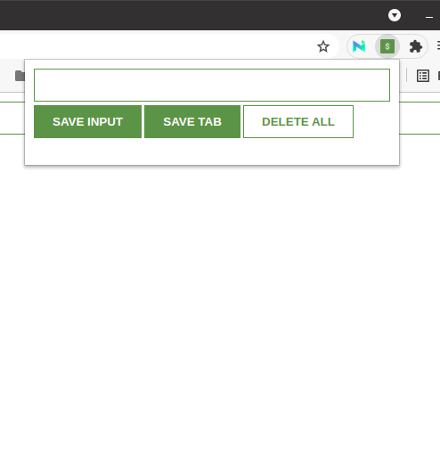

# Scrimba-Chrome_extension

> Chrome extension is created using javascript.

> 

In the learning of JavaScript I have followed the tuturial of Scrimba CEO to build a chrome extension to gather leads.

## Built With

- HTML & CSS with JavaScript
- None
- VS Code

## Authors

👤 **Author**

- GitHub: [@raovikrant82](https://github.com/raovikrant82)
- Twitter: [@Imvikrantrao](https://twitter.com/Imvikrantrao)

## 🤝 Contributing

Contributions, issues, and feature requests are welcome!

Feel free to check the [issues page](../../issues/).

## Show your support

Give a ⭐️ if you like this project!

## Acknowledgments

- Hat tip to Scrimba for such a wonderful tutorial
- Inspiration
- etc

## 📝 License

This project is [MIT](./MIT.md) licensed.
